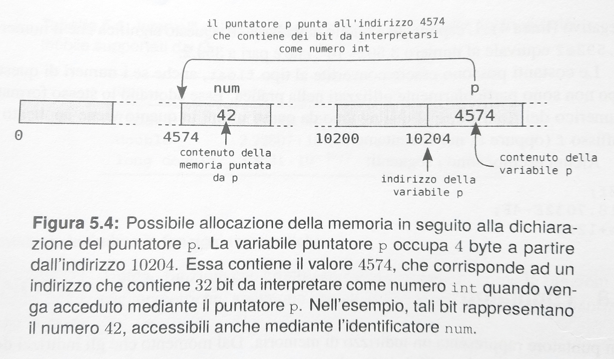

# Tipi di dato
* In un linguaggio di programmazione un tipo di dato identifica l'insieme dei valori che possono essere assunti da una variabile e le operazioni che si possono svolgere su di essi
* Tipizzazione consente al compilatore *(a)* di effettuare utili controlli sul tipo, *(b)* gestire allocazione della memoria in quanto ogni tipo di dato ha una determinata dimensione
* Per gestire correttamente un qualunque dato in memoria sono necessarie due informazioni: *(a)* l'indirizzo in cui il dato è memorizzato, *(b)* il tipo di dato rappresentato. **Il tipo di dato specifica due ulteriori caratteristiche: *(a)* la modalità di rappresentazione della variabile in memoria, *(b)* la quantità di memoria occupata da quella variabile**
* **Tipi base**: numeri interi, numeri in virgola mobile, indirizzi in memoria (puntatori)
* **Tipi derivati**: array, struct, union, tipi definiti dall'utente (in generale sono aggregazioni di tipi base)

# Tipi di dato


# Dichiarazione di variabili

* Con *dichiarazione di variabile* si intende il modo con cui in un file che segue la sintassi del linguaggio C viene richiesto di riservare memoria per contenere un certo dato e gli viene assegnato un nome simbolico (i.e., identificatore)
* Nel linguaggio C è obbligatorio dichiarare l’utilizzo di una variabile, ovvero dichiarare il **nome della variabile** dichiarare il **tipo della variabile**

```c
<tipo> <nome variabile> ;
```

```c
char c;
short s;
int i;
long l; 
long long ll;
float f;
double d;
long double ld;
```

# Definizione (o inizializzazione) di variabili

* *Dopo la dichiarazione le variabili non hanno un valore predefinito*. Quindi è necessario eseguire un'operazione di assegnamento per definirne un valore
* In questo modo la memoria allocata per la variabile viene anche riempita con un valore iniziale. Negli esempi sotto vengono utilizzate solo espressioni composte da *letterali numeriche* per definire i valori delle variabili

```c
<tipo> <nome-varibile> = <espressione> ;
```

```c
char c = 'a';
short s = 0xffff;
int i = 1024;
long n = 1024L;
float f = 3.1415F;
double d = 3.1415;
```

# Variabili costanti (di sola lettura)

* È possibile specificare che la variabile in memoria potrà essere solo letta, ovvero che è una variabile read-only, tramite la parola riservata *const*.
* Questa variabile è identica alle altre (ha un tipo, una locazione di memoria e viene definita), se non per il fatto che nessun comando successivo potrà modificarne il valore.
* **Attenzione!** In questo caso dobbiamo definire il valore della variabile nel momento della sua dichiarazione.

```c
const <tipo> <nome-varibile> = <espressione> ;
const double pi_greco = 3.1415926535897932384;
```

# Variabili costanti (di sola lettura)
```c
// compila
int main() {
    const int a=2, b=3;
    printf("a=%d, b=%d\n", a, b);
    return 0;
}
```

```c
// non compila
int main(){
    const int a=2, b=3;
    a = 3;
    b = 2;
    printf("a=%d, b=%d\n", a, b);
    return 0;
}
```

# Definizione di più variabili

* È possibile definire più variabili assieme per avere una scrittura più compatta. In pratica, si scrive il tipo una sola volta e si elencano di seguito le variabili che si intende definire
* È inoltre possibile aggiungere o meno una inizializzazione ad ogni variabile

```c
<tipo> <nome-var-1>, <nome-var-2>, ... , <nome-var-N> ;
```

```c
int i, j, k;
char a = 9, b = 23, c = 12; 
short s1, s2 = 33, s3;
```

# Memoria
* Le variabili locali (come quelle descritte negli esempi visti fino ad ora):
  * sono variabili definite all’interno di una funzione (e.g., funzione main)
  * sono allocate in una parte di memoria chiamata **stack**
  * il processo in esecuzione alloca automaticamente la memoria necessaria a contenerle nel momento in cui esegue la funzione
  * **ogni variabile occupa uno spazio di memoria contiguo. le variabili, fra di loro, possono non essere contigue**

* Il tipo che associamo a una variabile identifica due caratteristiche:
  * la modalità di rappresentazione della variabile in memoria
  * la quantità di memoria occupata da quella variabile


# Memoria


# Memoria


# I tipi di dati numerici interi
* Esistono due tipi di numeri interi (a prescindere dalla dimensione)
* **signed**: con segno (il termine signed è implicito nei tipi)  
  * intervallo = [-2^(bit-1) : +2^(bit-1)-1]
* **unsigned**: senza segno, ovvero solo numeri positivi 
  * intervallo = [0 : +2^(bit)-1]

| **Nome**  | **Dimensione Tipica** | **Descrizione** |
| --------- | -------------- | --------------- |
| char      | 1 byte | intero 8bit  |
| short     | 2 byte | intero 16bit |
| int       | 4 byte | intero 32bit |
| long      | 8 byte | intero 64bit |
| long long | 8 byte | intero 64bit |

# I tipi di dati numerici interi (rappresentazione)
* I numeri positivi sono rappresentati alla stesso modo sia nei tipi signed che unsigned. I numeri negativi utilizzano la notazione in complemento a 2 (-N viene rappresentato come 2^bit – N)
* La rappresentazione dei numeri è indipendente dall’endianness (**Big endian**: byte meno significativo mantenuto negli indirizzi più alti, **Little endian**: byte più significativo mantenuto negli indirizzi più alti)
  
| **Valore** | **Rappresentazione** | 
| ---------- | -------------------- | 
| 0          | 0 0 0 0 0 0 0 0      |
| 1          | 0 0 0 0 0 0 0 1      |
| -1         | 1 1 1 1 1 1 1 1      |
| -2         | 1 1 1 1 1 1 1 0      |
| -128       | 1 0 0 0 0 0 0 0      |

# I tipi di dati numerici interi (rappresentazione)


# I tipi di dati numerici interi (extra)
* I limiti degli intervalli delle variabili intere sono disponibili nella forma di macro (*limits.h*)
  * CHAR_MIN, CHAR_MAX
  * SHRT_MIN, SHRT_MAX
  * INT_MIN, INT_MAX
  * LONG_MIN, LONG_MAX
  * LLONG_MIN, LLONG_MAX
  
* In alcuni contesti si può preferire utilizzare tipi di variabili non nativi (i.e., definiti nell'ambito di una librerie), ma che ci danno indicazioni precise sulle dimensioni a prescindere dall’architettura impiegata. L'utilizzo di questi tipi standard richiede dipendenze aggiuntive come ad esempio *stdint.h* della [GNU C Library](https://www.gnu.org/softwae/libc/manual/html_node/Integers.html)
  * int8_t, int16_t, int32_t, int64_t
  * uint8_t, uint16_t, uint32_t, uint64_t

# Letterali numeriche
* *Dopo la dichiarazione le variabili non hanno un valore predefinito*. Quindi è necessario eseguire un'operazione di assegnamento per definirne un valore. In questo modo la memoria allocata per la variabile viene anche riempita con un valore iniziale
* Negli esempi sotto vengono utilizzate solo espressioni composte da *letterali numeriche* per definire i valori delle variabili

```c
char c = 'a';
short s = 0xffff;
int i = 1024;
long n = 1024L;
float f = 3.1415F;
double d = 3.1415;
```

# Letterali numeriche
* Le sequenze che iniziano con un numero (non possono essere identificatori!) sono chiamate costanti o letterali (literals) numeriche. *Da non confondere con le variabili dichiarate costanti (const)*. 
  * decimali: cominciano con una cifra da 1 a 9 e proseguono con altre cifre da 0 a 9.
  * ottali: cominciano con 0 e proseguono con altre cifre da 0 a 7.
  * esadecimali: cominciano con "0x" o "0X" e proseguono con altre cifre da 0 a 9 o con lettere (maiuscole o minuscole) da "A" a "F".
* Ogni letterale può essere inoltre seguita un postfisso che ne specifica il tipo (L=long, U=unsigned, F=float);
  
```
int n = 127  // 1 * 10^2 + 2 * 10^1 + 7 * 10^0
int n = 0177 // 1 * 8^2  + 7 * 8^1  + 7 * 8^0 
int n = 0x7f // 7 * 16^1 + 15 * 16^0
```
```
long n = 0x7fL // 127 rappresentato in notazione esadecimale specificando inoltre il tipo long
```

# Letterali numeriche


# I tipi di dati numerici in virgola mobile (IEEE 754-1985)
* I tipi *float* e *double* sono i cosiddetti numeri in virgola mobile, che rappresentano l’insieme dei numeri reali: con essi possiamo rappresentare numeri molto piccoli o numeri molto grandi, positivi e negativi, con e senza decimali.
* La differenza tra i due sta nel numero di bit riservati alla rappresentazione dei numeri, che si va a riflettere sul range di numeri e sul numero di cifre dopo la virgola che possiamo memorizzare. Quindi se abbiamo bisogno di particolare accuratezza, utilizziamo il tipo *double*.

| **Nome** | **Dimensione** | **Descrizione** |
| -------- | -------------- | --------------- |
| float | 4 byte | numero in virgola mobile a 32 bit |
| double | 8 byte | numero in virgola mobile a 64 bit |
| long double | 16 byte | numero in virgola mobile a 128 bit |

# I tipi di dati numerici in virgola mobile (Rappresentazione)
* Standard IEEE 754
* **N = -1 * segno x mantissa x 2^esponente**


# I tipi di dati numerici in virgola mobile (Extra)
* I limiti degli intervalli delle variabili intere sono disponibili nella forma di macro (*float.h*)
  * FLT_MIN, FLT_MAX 
  * DBL_MIN, DBL_MAX
  * LDBL_MIN, LDBL_MAX
  
# sizeof
* L'operatore **sizeof** indica la quantità di spazio di archiviazione, in byte, necessaria per archiviare un oggetto del tipo dell'operando. Tale operatore consente di evitare di specificare le dimensioni dei dati dipendenti dal computer nei programmi
* L'operando è un identificatore di tipo racchiuso tra parentesi e non può rappresentare un oggetto del campo di bit, un tipo incompleto o un indicatore di funzione
* **sizeof** ritorna una variabile di tipo **unsigned long**

```c
printf("Size of:\n");
printf("char=%lu\n", sizeof(char));
printf("short=%lu\n", sizeof(short));
printf("int=%lu\n", sizeof(int));
printf("long=%lu\n", sizeof(long));
printf("longlong=%lu\n", sizeof(long long));
```

# Errori comuni
* L’utilizzo inappropriato delle variabili può causare problemi seri e difficili da diagnosticare!
* **Errata interpretazione di dati** (e.g., dati signed negativi letti come unsigned danno vita a numeri e calcoli sbagliati!)

```c
int main(){
    int a = -5;
    printf("a=%u\n", a);
    return 0;
}
```

# Errori comuni
* L’utilizzo inappropriato delle variabili può causare problemi seri e difficili da diagnosticare!
* **Overflow o underflow delle variabili** (e.g., calcoli che sforano i range ammissibili producono errori nei calcoli e nel controllo di flusso)

```c
// esempio di overflow char[-128, 127]
// dovrebbe terminare non NON termina perchè char non può rappresentare il valore 200
int main() {
  char a;
  for(a=0; a<200; a++) { }
  return 0;
}
```

# Puntatori

* Un puntatore rappresenta un indirizzo di memoria. Dal momento che gli indirizzi della memoria sono interi positivi, in
  pratica un puntatore è un numero intero senza segno
* *Un puntatore non contiene il valore di una variabile tradizionale, ma l'indirizzo di una locazione di memoria in cui sono immagazzinati un numero congruo di bit per essere interpretati come il tipo indicato*
* L'operatore **&** (si legge *l'indirizzo di*) e consente di conoscere l'indirizzo di una variabile
* L'operatore **\*** (si legge *il valore di*) permette di accedere e/o modificare il valore contenuto all'indirizzo di memoria specificato da un puntatore

```c
int *p, num = 42;
p = &num
*p = 3
```

# Puntatori
* Un assegnamento come il seguente:

```c
int num2;
num2 = *p;
```

* Accede in lettura al valore memorizzato all'indirizzo puntato da p e lo assegna alla variabile num2
* In pratica, dopo l'assegnamento effettuato precedentemente, alla variabile num2 viene assegnato il valore 3

# Puntatori


# Puntatori
* Come tutte le variabili, i puntatori sono caratterizzati da un proprio indirizzo e da una dimensione. I puntatori sulla stessa macchina sono tutti della stessa dimensione. 16, 32 o 64 bit a seconda del processore (o sistema
operativo) su cui si lavora.
* Come ogni altra variabile, anche un puntatore, finché non viene inizializzato, contiene una sequenza di bit casuali che
difficilmente corrisponde a un indirizzo di memoria valido. **Tale situazione può essere causa di errori difficilmente identificabili**

```c
int main(){
    int *p;

    printf("%d\n", *p);
    *p = 5; /* male! scrive in un'area imprecisata della memoria del processo */ 
    printf("%d\n", *p);
}
```

# Puntatore nullo
*  Il *puntatore nullo* vale zero e non è un puntatore valido; nelle funzioni che ritornano un puntatore è spesso ritornato come segnalazione di errore. La macro NULL vale 0, e 0 è confrontabile con qualunque puntatore.

```c
char *p;
if (p != NULL) {
  /* istruzioni */
}
```

```c
char *p;
if (p) {
  /* istruzioni */
}
```

# Array
* Gli array permettono di memorizzare in aree contigue di memoria un numero fissato di elementi di tipo omogeneo
(tutti dello stesso tipo)
* E' possibile identificare univocamente tutti gli oggetti dell’array in modo sistematico tramite l’uso di indici numerici che, in un array di lunghezza N, vanno da 0 ad N-1.
* A seconda del numero di dimensioni dell'array, essi vengono chiamati vettori (d=1), matrici (d=2), o array multidimensionali (d>2)

# Vettori
* I vettori, o array monodimensionali, permettono di allocare un insieme di elementi dello stesso tipo in zone contigue
della memoria
* La sintassi per la dichiarazione di un vettore è la seguente:

```c
nome-tipo identificatore [ cardinalità ] ;
```

* **nome-tipo** è un tipo di dato, sia semplice che derivato
* **identificatore** è il nome che identifica il vettore
* **cardinalità** è una costante intera che indica da quanti elementi è costituito il vettore

# Limiti di indicizzazione di un vettore
* Si consideri un vettore di cardinalità N

```c
int num[5];
```

* L'identificatore associato al vettore è num
* Ciascun elemento del vettore è di tipo int
* Valori validi dell'indice sono limitati all'intervallo [0, 5-1]

# Vettori


# Vettori
* Gli elementi di un vettore vengono sempre memorizzati in  aree contigue della memoria. In questo modo l'indirizzo dell'elemento di indice i può essere ricavato con un semplice calcolo
* Se **base** è l'indirizzo del primo elemento del vettore e **dim** la dimensione in byte di ciascun elemento, allora l'indirizzo **addr** dell'elemento di indice i è pari a: 

```c  
addr = base + i * dim
```

* Considerando l'esempio precedente, essendo base uguale a 1024 e dim uguale 4, l'indirizzo dell'elemento di indice 2
(num[2]) è 1024 + 2 * 4 = 1032
  
# Nome del vettore e indirizzo
* Il nome di un vettore è un puntatore costante il cui valore corrisponde all'indirizzo del primo elemento del vettore

```c
num == &num[0]
```

* È vera anche la seguente espressione:

```c
*num == num[0]
```

```c
int main() {
    int n[16] = {};

    printf("%p\n", n);
    printf("%p\n", &n[0]);
    printf("%d\n", *n);
    printf("%d\n", n[0]);
}
```

# Violazione dei limiti di un vettore
* Nel caso si tenti di accedere ad un elemento del vettore utilizzando un indice con valore al di fuori dell'intervallo
ammesso, nel migliore dei casi il programma termina con un errore di **segmentation fault** (violazione di memoria),
ovvero di accesso ad una area di memoria alla quale non è permesso accedere
* In altri casi l'accesso errato va a leggere/scrivere una porzione di memoria che appartiene al programma corrente,
allocata nella memoria presente oltre la dimensione del vettore. Questa situazione è molto pericolosa per il funzionamento del programma, in quanto possono verificarsi comportamenti indesiderati, imprevedibili, e spesso molto difficili da diagnosticare


# Inizializzazione di un vettore
* L'inizializzazione di un vettore può essere effettuata senza specificarne la dimensione, ma semplicemente elencandone gli elementi. Non viene specificata la cardinalità del vettore, ma si racchiude tra parentesi graffe una lista di elementi separati
da virgola. Il compilatore dimensiona il vettore sulla base del numero di valori utilizzati per l'inizializzazione

```c
int dxm[] = {31,28,31,30,31,30,31,31,30,31,30,31};
```

* È possibile dichiarare un vettore di una determinata dimensione e inizializzarne esplicitamente solo i primi elementi, mentre i rimanenti elementi verranno inizializzati a 0
```c
int n[10] = {1, 5, 3};
```

* Un modo semplice per inizializzare a 0 tutti gli elementi di un vettore è:
```c
int n[10] = {};
```

# Uso di macro con vettori e cicli
* In ogni punto del programma viene usata la macro MAX per fare riferimento alla dimensione del vettore
* Il valore della macro MAX è definito in un unico punto e quindi esiste un unico punto di aggiornamento
* Dopo la ricompilazione, il valore corretto viene utilizzato sia per dimensionare il vettore e che per controllare il ciclo

```c
#define MAX 10
int vet[MAX];
for (i = 0; i < MAX; i++) {
    /* ... */
}
```

# Operatore sizeof
* L'operatore sizeof si applica ad un tipo, ad un nome di variabile o ad un'espressione
* Restituisce la dimensione in byte dell'oggetto indicato. Il calcolo viene effettuato durante la fase di compilazione in
base al tipo di dato che viene passato a sizeof

```c
int i, v[10], *p;
i = sizeof(char); // 1
i = sizeof(int);  // normalmente 4, ma anche 2
i = sizeof(v[0]); // 4 o 2
i = sizeof(*p);   // 4 o 2
i = sizeof(p);    // 8 o 4 (dimensione del puntatore)
i = sizeof(v);    // 40 o 20
i = sizeof(v)/sizeof(*v); /* 10: numero di elementi del vettore v */
```

# Array e puntatori
* Nella maggior parte dei casi, puntatori ed array possono essere utilizzati in modo intercambiabile. Esistono però alcune eccezioni:

* **Operatore sizeof**
  * sizeof(array) ritorna la quantità di memoria usata da tutti gli elementi dell'array
  * sizeof(puntatore) ritorna la quantità di memoria usata dal puntatore stesso
* **Operatore &**
  * &array è un alias di &array[0] e ritorna l'indirizzo del primo elemento dell'array
  * &pointer ritorna l'indirizzo del puntatore stesso

# Array e puntatori

```c
void stampa_array(const int *v, unsigned size) {
    unsigned i;

    for (i = 0; i < size; i++) {
        printf("%d\n", v[i]);
    }
}

int main(void) {
    int v[16];
    int *v2 = v;

    printf("%ld\n", sizeof(v));     /* 64 */
    printf("%ld\n", sizeof(v2));    /* 8 */
    printf("%p\n", &v[0]);          /* 0x7ffeedce4890 */
    printf("%p\n", &v2);            /* 0x7ffeedce4888 */
}
```

# Una macro utile per i vettori
```c
#define ARRAY_SIZE(x) (sizeof(x)/sizeof(*x))
```

* Restituisce il numero di elementi di un vettore, e si utilizza passando come argomento l'identificatore di un
vettore. Ad esempio:
  
```c
int dim, v[10];
dim = ARRAY_SIZE(v);
```

* A dim viene  assegnato il valore 10. Si noti che il risultato non dipende dalla dimensione del tipo di dato

# Vettori di caratteri
I vettori di caratteri non differiscono dagli altri vettori. Esempi di dichiarazione:
```c
char vet[4];
char vet1[] = { 'a', 'b', 'c', '\n' };
char vet2[4] = { 'a' };
char vet3[] = { '0', 0 };
```

* **vet** non è inizializzato, **vet1** è un vettore di 4 caratteri inizializzato,
* **vet2** è ancora di 4 caratteri (il primo 'a', poi riempito di zero)
* **vet3** memorizza 2 valori: il codice del carattere 0, il valore 0 (sono due costanti diverse)

# Le stringhe
* Una stringa costante è rappresentata da una sequenza di 0 o più caratteri racchiusi fra doppi apici, per esempio:

```c
char str[] = "Hello World!\n";
```

* La memorizzazione di una stringa comprende i caratteri che effettivamente la compongono, più un carattere di terminazione che delimita l'ultimo carattere della stringa (delimitatore)
* Il carattere di terminazione è il byte di valore numerico 0 (zero). Esso non corrisponde ad un carattere ASCII stampabile
* La dimensione di una variabile stringa deve prevedere lo spazio sufficiente per includere anche il carattere zero di
  terminazione, oltre ai caratteri "effettivi" che compongono la stringa
* La stringa vuota è rappresentata da "" (due doppi apici consecutivi), occupa 1 byte, che memorizza il carattere di terminazione


# Il carattere di terminazione
```c
#include <stdio.h>

int main(){
char str1[] = "str1";
char str2[128] = "str2";
char str3[4] = "str3";

    printf("%d %d %d\n", sizeof(str1), sizeof(str2), sizeof(str3));
    printf("%s %s %s\n", str1, str2, str3);
    str3[3] = 0;
    printf("%s %s %s\n", str1, str2, str3);
}
```

# Lettura di stringhe da tastiera
* Per la lettura si possono usare sia la funzione *gets*, che la *scanf*

```c
char buffer[100];
gets(buffer);
scanf("%s", buffer);
```

* La funzione gets elimina il carattere di newline, ma aggiunge il carattere di fine stringa \0
* Anche la scanf aggiunge il fine stringa, ma occorre prevedere abbastanza spazio per memorizzare i caratteri e il
fine stringa. Nell'esempio se vengono immessi più di 100 caratteri l'esecuzione diventa imprevedibile (e potenzialmente pericolosa)
  
# Caratteri e Stringhe
* Caratteri e stringhe sono diversi e non vanno confusi:
  * un carattere è in realtà un numero intero (per denotare una costante di tipo carattere: 'x')
  * una stringa è un vettore di caratteri che termina con il carattere '\0' (per denotare costanti di tipo stringa: "un esempio di stringa")
* Una variabile di tipo stringa è in realtà un puntatore al primo carattere del vettore

```c
char c = 'a';  // carattere
char *s = "a"; // puntatore alla stringa costante "a"
char v[] = "a"; // vettore di 2 caratteri inizializzato a {'a', '\0'}
printf("%d %d %d\n", sizeof(c), sizeof(s), sizeof(v)); // Output: 1 4 2
```

# Funzioni di libreria (caratteri)
```c
#include <ctype.h>

int toupper(int ch);
int tolower(int ch);
int isupper(int ch);
int islower(int ch);
int isalpha(int ch);
int isdigit(int ch);
```

# Funzioni di libreria (stringhe)
```c
#include <stdlib.h>
#include <string.h>

int atoi(const char *str);
long atol(const char *str);
double atof(const char *str);

int strcmp(const char *s1, const char *s2);
int strcasecmp(const char *s1, const char *s2);
char *strcpy(char *dest, const char *src);
char *strcat(char *dest, const char *src);
char *strdup(const char *s1);

size_t strlen(const char *str);
```