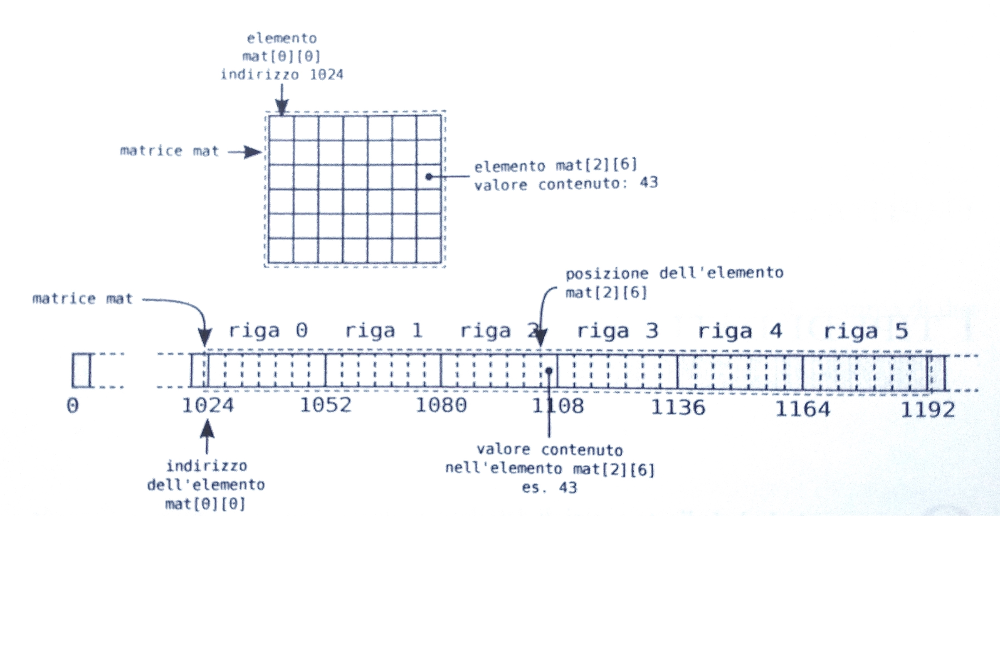
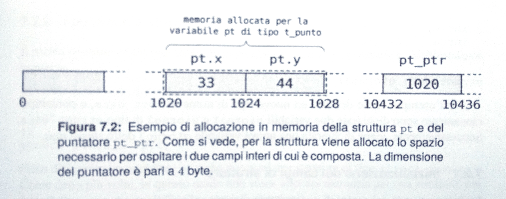

# Array multi-dimensionali
* Si tratta di una generalizzazione del concetto di vettore
* Sono permesse un numero arbitrario di dimensioni per la struttura dichiarata
* Il caso tipico di array multi-dimensionale è quello di array a due dimensioni, le cosiddette *matrici*
* La sintassi della dichiarazione di un array multi-dimensionale è la seguente:

```c
nome-tipo identificatore [ card_1 ] [ card_2 ] ... [ card_n] ;
```

# Le matrici
* La matrice è tecnicamente un array a 2 dimensioni. Può essere vista come un vettore monodimensionale i cui singoli elementi sono vettori essi stessi. La sintassi della dichiarazione di una matrice è la seguente:

```c
nome-tipo identificatore [ card_1 ] [ card_2 ] ;
```

* *nome-tipo* è un qualsiasi tipo di dato, sia semplice che derivato
* *identificatore* è il nome che identifica la matrice
* *card_1* e *card_2* indicano la cardinalità delle due dimensioni (righe e colonne)

# Esempio 
Esempio di dichiarazione di matrice:

```c
int mat[6][7];
mat[2][6] = 3;
printf("%d\n", mat[2][6]);
```

* La matrice si chiama *mat*
* La matrice ha 6 righe e 7 colonne
* Le due componenti sono indicizzate da 0 a 5 (righe) e da 0 a 6 (colonne)
* L'elemento mat[2][6] è un valore di tipo intero che può essere utilizzato come un qualunque altro valore intero

# Le matrici: allocazione
* La matrice è una struttura bidimensionale. Va definito il modo in cui mapparla all'interno della memoria RAM, che è al contrario una struttura monodimensionale
* **Una matrice viene allocata in memoria per righe**. Si parte dall'indirizzo dell'elemento di indice mat[0][0] e si prosegue memorizzando in successione tutti i valori della matrice riga dopo riga.

# Le matrici: allocazione 



# Le matrici: inizializzazione
* Quando viene dichiarata, una matrice può anche essere inizializzata specificando un elenco di valori per i suoi elementi
* Tra parentesi graffe è racchiusa una lista di elementi separata da virgola
* Ciascun elemento rappresenta una riga della matrice che, a sua volta, è una lista di valori separati da virgola e racchiusa tra graffe

```c
int mat[2][4] = {
    {1, 2, 3, 4},
    {5, 6, 7, 8} 
};
```

# Le matrici: inizializzazione
* Quando nella dichiarazione della matrice si inizializzano i suoi valori, non è necessario indicare la prima dimensione (il numero di righe). Viene automaticamente calcolata dal compilatore in base ai valori usati per l'inizializzazione.
* Eventuali valori mancanti vengono inizializzati a 0

```
int mat[][4] = {
    {1, 2, 3, 4},
    {5, 6, 7, 8},
    {9},
    {0} 
};
```
```
1 2 3 4 
5 6 7 8 
9 0 0 0 
0 0 0 0
```

# Le matrici: inizializzazione

```
int mat[][4] = {
    {1},
    {1, 9},
    {1, 7, 3, 5},
};
```
```
1 0 0 0 
1 9 0 0 
1 7 3 5 
```

```
int mat[2][2] = { {0} };
```

```
0 0 
0 0
```

# Matrici come parametri di funzione
* A volte capita di dover elaborare delle matrici di cardinalità prefissata per mezzo di funzioni
* Per comprendere come una matrice deve essere passata a una funzione è utile ricordare che essa può essere vista come un vettore, i cui elementi sono, a loro volta, vettori di cardinalità pari al numero di colonne (le righe della matrice)
* Quando un array multi-dimensionale viene passato a una funzione, questa riceve l'indirizzo del suo primo elemento
* Per dichiarare il tipo del parametro corrispondente, si devono indicare tutte le cardinalità dell'array, eccetto la prima
* Nel caso di una matrice, il tipo del parametro che viene passato è quello di un puntatore a vettore della dimensione di una riga la sua dichiarazione deve fare riferimento al numero di colonne della matrice


# Matrici come parametri di funzione
```c
void do_stuff(int rows, int cols, int v[][cols]) {
int i, j;

    for (i = 0; i < rows; i++) {
        for (j = 0; j < cols; j++) {
            printf("%3d", v[i][j]);
        }
        printf("\n");
    }
}

int main(void) {
    int v[ROWS][COLS] = { {1, 2, 3}, {4, 5, 6}, };

    do_stuff(ROWS, COLS, v);
}
```

# Le strutture
* Una struttura, o **struct**, è un tipo di dato derivato che permette di aggregare un insieme di elementi, detti campi, all'interno di un unica entità da gestire in modo unitario
* Si raggruppano variabili che hanno una correlazione logica per il problema da risolvere
* I campi di una struttura possono essere di tipo diverso, sia tipi semplici che derivati, incluse altre strutture
* Dopo la dichiarazione, *struct nome è il nome di un nuovo tipo di dato* che può essere usato per dichiarare variabili e puntatori

```c
 struct nome {
       tipo-campo nome-campo ;
       [tipo-campo nome-campo ; ... ]
};
```

# Esempio (struct punto)
* Le variabili di nome pt e pt1 sono di tipo struct punto
* L'identificatore pt è associato ad una porzione di memoria in grado di conservare due dati di tipo int, i campi della struttura
* I campi si chiamano x e y

```c
struct punto {
    int x;
    int y;
};

struct punto pt, pt1; /* dichiara due variabili */
struct punto *pt_ptr; /* dichiara un puntatore */
```

# Esempio (struct punto)




# Accesso ai campi

* Per far riferimento ai valori memorizzati nei singoli campi si usa la notazione

```c
<nome variabile>.<nome campo>
pt.x = 5;
pt.y = -7
```

* Le strutture si possono anche assegnare direttamente 

```c
pt1 = pt;
```

# Puntatori a struttura

* *pt_ptr* è un puntatore a struttura e memorizza l'indirizzo di una struttura (*struct punto*)
* La sua dichiarazione, non alloca memoria per una struttura ma soltanto per un puntatore ad essa
* La due istruzioni seguenti, ottengono il medesimo scopo, ed assegnano a *pt_ptr* l'indirizzo della struttura *pt*

```c
pt_ptr = &pt;
*pt_ptr = pt;
```

# Strutture come parametri di funzioni

* Anche se è consentito, le strutture non vengono normalmente passate né come argomenti né vengono utilizzate come valori di ritorno
* In caso si utilizzi un puntatore, la notazione va adeguata

```c
double distanza(struct punto p1, struct punto p2) {
     return hypot(p1.x - p2.x, p1.y - p2.y);
}
```

```c
double distanza(struct punto *p1, struct punto *p2) {
    return hypot((*p1).x - (*p2).x, (*p1).y - (*p2).y);
}
```

```c
double distanza(struct punto *p1, struct punto *p2) {
    return hypot(p1->x - p2->x, p1->y - p2->y);
}
```

# Strutture come parametri di funzioni
* Il passaggio dei parametri per valore richiede l'allocazione di una copia locale delle variabili dichiarate nella lista dei parametri
* Oltre all'allocazione, tali variabili devono anche essere inizializzate per riflettere il valore della espressione del chiamante
* Questo comporta la copia esplicita di una porzione di memoria dalla variabile utilizzata per la chiamata alla variabile locale
* C'è una perdita di efficienza nel passaggio dei parametri per valore proporzionale alla dimensione della variabile
* Il passaggio per riferimento elimina il tempo necessario per effettuare la copia
* Viene copiato soltanto l'indirizzo della variabile
* Esso ha dimensione limitata e fissa (la dimensione di un puntatore)
* Questo rende più veloce la chiamata alla funzione
* Questo approccio migliora l'efficienza dei programmi

# Inizializzazione dei campi di strutture

* prima forma poco leggibile, legata all'ordine
* seconda fuori standard
* terza ok
* tutti i campi non specificati vanno a 0

```c
struct info {
    int id;
    char *nome;
    int valore;
    int privato;
}

struct info el1 = {3, "aldo", 45};
struct info el2 = {id: 3, nome: "aldo", valore: 45};
struct info el3 = {.id 3, .nome "aldo", .valore 45};
```

# Confronto fra strutture

esempio datecmq

# typedef

* In C è possibile assegnare dei nomi simbolici ai tipi di dati esistenti
* Migliora la chiarezza di programmi lunghi e complessi
* La definizione di un nuovo tipo si realizza per mezzo della parola chiave **typedef**. La sintassi è la seguente:

```c
typedef tipo nuovo-tipo;
```

* L'istruzione associa il nome *nuovo-tipo* al tipo *tipo*

# typedef
* In UNIX per tenere traccia del trascorrere del tempo in unità discrete si usa la seguente definizione:

```c
typedef long time_t;
```

* Questo permette di individuare facilmente nel programma le variabili che sono collegate alla gestione del tempo
* Esse sono dichiarate di tipo *time_t*, distinguendole da generiche variabili di tipo long utilizzate per altri scopi
* Il fatto di affermare che le variabili sono *dichiarate di tipo time_t* è un po' improprio. L'assegnazione del nome time_t al tipo long non crea un nuovo tipo di dato dal punto di vista semantico una variabile dichiarata di tipo long è perfettamente equivalente ad una di tipo time_t

# typedef
* E' possibile assegnare un nome sintetico a tipi complessi, questo aumenta la chiarezza del codice
* Si possono definire e utilizzare variabili di tipo cerchio_t

```c
typedef struct {
    int x, y;
    int raggio;
} cerchio_t;
```

```c
int uguale(cerchio_t c1, cerchio_t c2) {
    return ((c1.x == c2.x) && (c1.y == c2.y) && (c1.raggio == c2.raggio));
}
```

# Le enumerazioni (enum)

* Le enumerazioni sono usate per definire degli insiemi omogenei di costanti intere
* A ciascuna costante viene associato un nome univoco
* Il loro scopo è quello di rendere più comprensibile il codice, permettendo di dichiarare insiemi di costanti dal significato logico coerente
* Una variabile di tipo enum può essere usata in tutti i contesti nei quali è possibile usare variabili intere (l'indicizzazione di vettori, espressioni)
* Le enumerazioni rappresentano una alternativa alle macro del preprocessore per la definizione di costanti
* Hanno il vantaggio che i valori numerici vengono assegati automaticamente dal compilatore
* Al contrario delle macro, si tratta di tipi veri e propri su cui vengono fatti tutti i controlli di coerenza d'uso

# Le enumerazioni (enum)
La sintassi è la seguente:

```c
enum identificatore { lista-di-elementi }
```

* *lista-di-elementi* è un elenco di identificatori separati dalla virgola
* Al primo elemento viene assegnato il valore 0 
* Ogni elemento successivo viene incrementato di 1 
* E' possibile effettuare degli assegnamenti espliciti

```c
enum direzioni { nord, sud, ovest, est };
enum direzioni dir = est;
```

# Le enumerazioni (enum)

* Il seguente codice usa una enumerazione per dichiarare delle costanti associate ai punti cardinali
* A nord viene assegnato il valore 0, sud = 1, ovest = 10, est = 11
* Segue un esempio di uso (dichiaro una variabile e la inizializzo al valore est)
* Spesso il valore numerico non ha importanza, i nomi sono semplici etichette (non è definito un ordinamento)


```c
enum direzioni { nord, sud, ovest = 10, est };
enum direzioni dir = est;
```


# Le enumerazioni (enum)

```c
typedef enum { falso, vero } booleano;
booleano flags[10] = { vero };
booleano flag = vero;
printf("%d", flag);
printf("%s", flag != falso ? "vero" : "falso");
flag = 5; // non dà errori in compilazione

// in alternativa
#define booleano int
#define falso 0
#define vero 1
```
